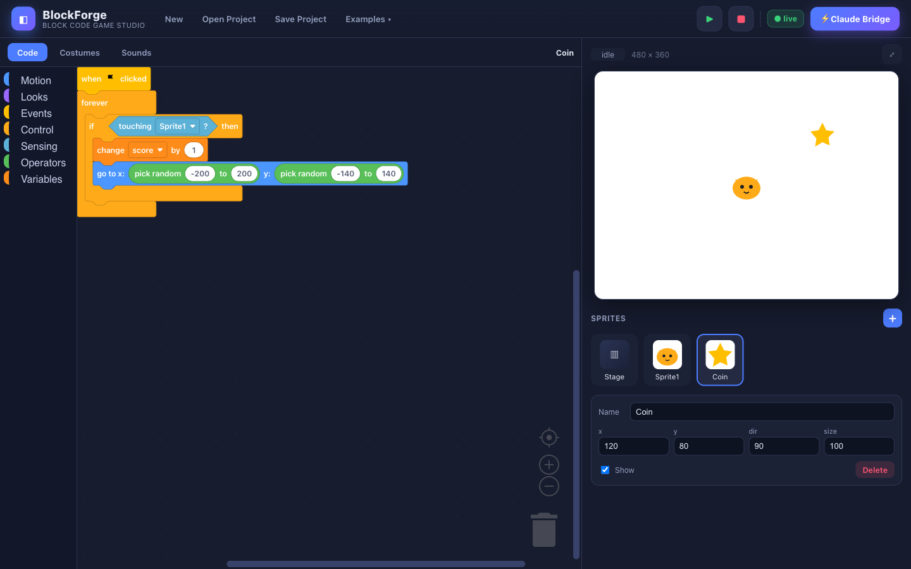

# BlockForge — Block Code Game Studio

A high-end, Scratch-style visual block coding environment for making games — with a
**Claude Bridge**: tell Claude what to build, it writes a project, and you refine every
block, sprite and costume by hand.



## Features

- **Real Scratch-style blocks** — drag, snap and nest, built on Blockly's Zelos renderer
  with the full palette: Motion, Looks, Events, Control, Sensing, Operators, Variables.
- **Live stage** — 480×360 canvas with a green-thread VM (the actual Scratch execution
  model): `forever` / `repeat` / `wait` cooperatively yield per frame.
- **Sprites & costumes** — add sprites, upload images or generate shapes, set position /
  direction / size / visibility from the inspector.
- **Game features** — keyboard & mouse input, collision (`touching`), variables with on-stage
  monitors, broadcasts, ask/answer, glide, effects, scoring.
- **Live Claude Bridge** — like the Roblox Studio MCP: keep the editor open, tell Claude what
  you want, and sprites/costumes/scripts appear live. Claude also reads your edits.
  See [`claude-plugin/README.md`](claude-plugin/README.md).

## Run it (live bridge)

```bash
cd BlockForge
node bridge/server.js
# open http://localhost:4321   — badge turns ● live when connected
```

Then just tell Claude: *"add an enemy that chases the player and a score"* — it builds it
right there. The bridge has **zero dependencies** (plain Node).

> Offline? Open `index.html` via `file://` and use the **Open Project** / **Save Project**
> buttons instead. Everything except the live bridge works without the server.

## Using the Claude Bridge

1. Start the server and open `http://localhost:4321` — the badge shows **● live**.
2. Ask Claude in plain language: *"make a maze game"*, *"give the player 3 lives"*, *"make the coin spin"*.
3. The change appears in your editor instantly. Drag blocks, add sprites & costumes, hit **▶** to play.
4. Ask for the next change — Claude reads your live edits via `GET /state` and builds on them.

## Layout

```
BlockForge/
├── index.html          # app shell
├── css/style.css       # high-end dark UI
├── js/
│   ├── blocks.js       # Scratch-style block defs, theme & toolbox
│   ├── vm.js           # green-thread interpreter + stage renderer
│   └── app.js          # editor wiring, sprites, costumes, project I/O, bridge
├── projects/           # Claude-authored projects (.bfproject.json)
└── claude-plugin/      # the bridge: project format + block reference
```

## Built-in examples

Use the **Examples ▾** menu (Bouncing Ball, Drive with Arrows) or load the Claude-authored
**Pong** with `index.html?project=pong`.
